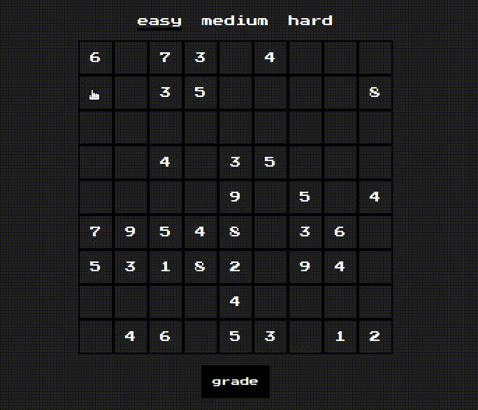

# Sudoku Vanilla

This is a classic sudoku game using the [suGOku](http://sugoku.herokuapp.com/) API to get a puzzle and grade it. you have a possibility to choose difficulty and grade your self.

## Live Link

In the following link, you can view the app [here](https://rachidelaid.github.io/sudoku-vanilla/).

## Built With

- HTML
- CSS
- JAVASCRIPT

## Getting Started

start by cloning the repository.

`git clone https://github.com/rachidelaid/sudoku-vanilla.git`

cd to the folder.

`cd sudoku-vanilla`

## Authors

👤 **Rachid El aid**

- GitHub: [@rachidelaid](https://github.com/rachidelaid)
- Twitter: [@rachidelaid1](https://twitter.com/rachidelaid1)
- LinkedIn: [Rachid El aid](https://www.linkedin.com/in/rachid-elaid-106336203/)

## 🤝 Contributing

Contributions, issues, and feature requests are welcome!

Feel free to check the [issues page](../../issues/).

## Show your support

Give a ⭐️ if you like this project!
